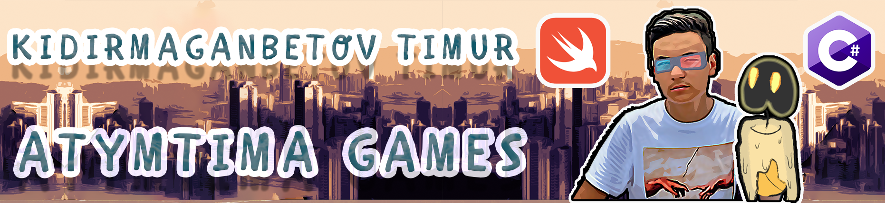
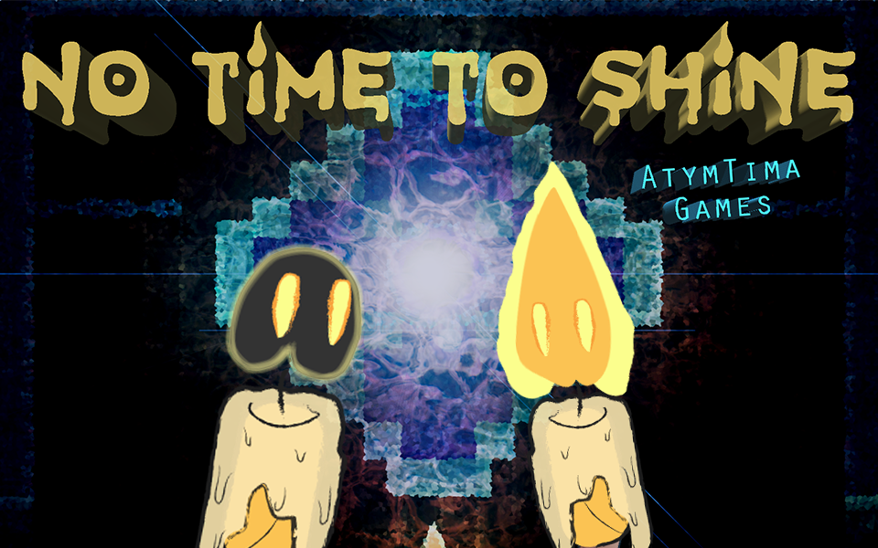
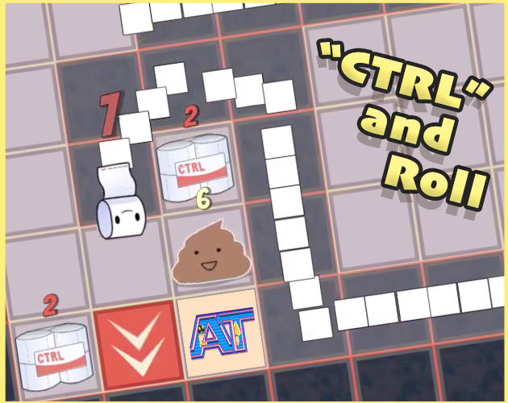

### Hi there 👋

<!--
**AtymTima/AtymTima** is a ✨ _special_ ✨ repository because its `README.md` (this file) appears on your GitHub profile.
-->

I make Indie Games in Unity using **C#** and mobile applications using **Swift**. I am strongly passioned in sharing my knowledge with other developers and inspire them to challenge themselves and become better every day. That's why I have a **YouTube channel** related to [Indie Game Development](https://www.youtube.com/channel/UCOC6KNeqE7RAaU0kp_Z157w/videos). 

🎮 My current/finished games:\
➼ ["No Time To Shine"](https://atymtima.itch.io/no-time-to-shine)\
<!---->

➼ ["Roll Control"](https://www.youtube.com/watch?v=25bAOAxzFoY&list=PLNqhTV8777VFIH5q5tfV7m1Zn4TNTjg_d) *in progress*
<!--{:height="100px" width="126px"} -->

📱 My current/finished mobile applications:\
➼ *Soon*

💻 Study and education:\
➼ Graduated from the Nazarbayev Intellectual School of Physics and Mathematics in Almaty (2019)\
➼ Getting the Bachelor Degree in The Hong Kong Polytechnic University (2023) 🇭🇰\
➼ Completed the 7-week app development bootcamp nFactorial Incubator 2018

⚒️ Additional Skills:\
➼ Video-Editing\
➼ Zero-sleep programming

📞 Where to find me at:\
➼ [YouTube channel](https://www.youtube.com/channel/UCOC6KNeqE7RAaU0kp_Z157w/videos)\
➼ Main email address: kidir.timur@gmail.com\
➼ Games related email address: atymtima.games@gmail.com
